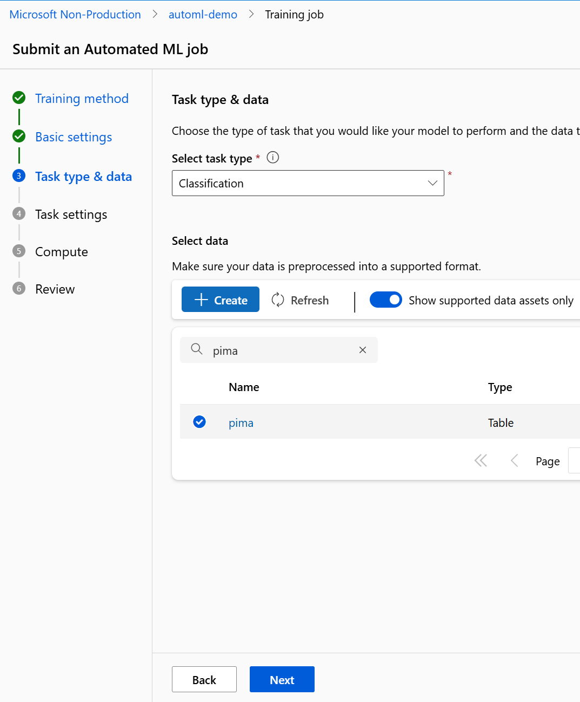

# Use AutoML in Azure ML Studio

## Introduction

Quality Healthcare has identified the need to develop a model to predict if patients will develop diabetes.

## Description

In this task, you will leverage the AutoML and compute to train a model to predict patient outcome of having diabetes or not.

To build a dataset inside of ML Studio please follow these steps off an AutoML job here are the following key tasks:

1. The following steps are used to setup data within ML Studio:

To kick off an AutoML job here are the following key tasks:

1. Use [Azure ML Studio](https://ml.azure.com) to kick off an Automated ML Job.

2. Fill in the job and experiment name and click next.

3. Select task type as Classification and choose Pima for the dataset and click next.

4. For the target column choose Outcome and for the Experiment timeout (minutes) enter 15.

5. Select Serverless Compute and a VM and click next.

6. Click on Submit training job.

## Success Criteria

* AutoML job runs and completes in 15 minutes. It should highlight which features are the most important to the performance of the model. All artifacts are generated and stored inside the storage account and container.